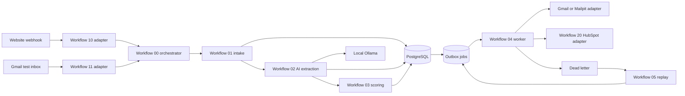

# Architecture

```mermaid
flowchart LR
    Web[Website webhook] --> A10[Workflow 10 adapter]
    Gmail[Gmail test inbox] --> A11[Workflow 11 adapter]
    A10 --> O[Workflow 00 orchestrator]
    A11 --> O
    O --> I[Workflow 01 intake]
    I --> DB[(PostgreSQL)]
    I --> AI[Workflow 02 AI extraction]
    AI --> Ollama[Local Ollama]
    AI --> DB
    AI --> S[Workflow 03 scoring]
    S --> DB
    DB --> Outbox[(Outbox jobs)]
    Outbox --> W[Workflow 04 worker]
    W --> Mail[Gmail or Mailpit adapter]
    W --> H[Workflow 20 HubSpot adapter]
    W --> Dead[Dead letter]
    Dead --> R[Workflow 05 replay]
    R --> Outbox
```

PostgreSQL is the durable system of record. Adapters can change without changing
the intake, AI, scoring, or recovery rules.
